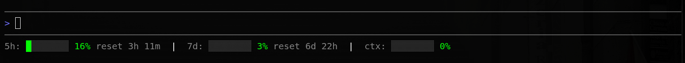

<div align="center">

# 🛰️ agy-status-line

**A compact, configurable status line for the [Antigravity CLI](https://github.com/mkomod/agy-status-line).**
Live usage quotas and context-window fill — right under your prompt.




</div>

---

## ✨ Features

- 📊 **Usage limits** — 5-hour and weekly quota bars that **fill as you use them**, with live reset countdowns
- 🪟 **Context window** — see how full the model's context is at a glance
- 🎨 **Fully themeable** — segments, colours, ANSI codes, and bar style all live in `config.toml`
- 📐 **Responsive** — wraps onto multiple lines when the terminal is narrow
- 🕒 **Optional extras** — toggle a clock (and more) on/off
- 🪶 **Zero dependencies** — pure Python standard library

## 🚀 Quick start

```bash
git clone https://github.com/mkomod/agy-status-line.git
cd agy-status-line
bash install.sh
```

Restart the Antigravity CLI and the status line appears under your prompt. That's it.

## ⚙️ Configuration

Everything presentational lives in **`config.toml`** — no code changes needed.

```toml
[modules]            # toggle segments on/off; this order is the render order
"5h" = true          # 5-hour usage quota
"7d" = true          # weekly usage quota
ctx = true           # context-window fill
clock = false        # current time

[colors]             # role -> colour name (defined in [color_codes])
bar = "green"
value = "green"
label = "dim"

[display]
bar_width = 8        # characters per bar
separator = "  |  "  # text between segments
fill_char = "█"
empty_char = "░"
fallback_width = 80  # assumed terminal width when the payload omits it

[color_codes]        # colour name -> ANSI escape
green = "\u001b[92m"
dim   = "\u001b[2m"
reset = "\u001b[0m"  # required
# ... red, yellow, blue, magenta, cyan, white, gray, black, none
```

Missing the file or a value? Safe built-in fallbacks kick in (uncoloured but functional).

### Make it yours

| Want… | Change |
| --- | --- |
| A clock | `clock = true` |
| Fewer segments | set any to `false` |
| A different colour | point a role at another name, e.g. `bar = "cyan"` |
| Chunkier bars | `bar_width = 12` |
| ASCII-only bars | `fill_char = "#"`, `empty_char = "-"` |

## 🧩 How it works

The Antigravity CLI pipes a JSON status payload to its status-line command on
**stdin** every render. `status_line.py` reads that payload — model, quotas,
context window — and prints the bars. No file scraping, no background polling.

The quota group follows the active model: `gemini-*` quotas for Gemini models,
`3p-*` for Claude/GPT models.

## 📦 Project structure

```
.
├── status_line.py   # reads the stdin payload, renders the bars
├── config.toml      # segments / colours / display
├── install.sh       # one-shot installer
└── plugin.json      # plugin metadata
```

> **Install note:** `install.sh` writes a `statusLine.command` block into
> `~/.gemini/antigravity-cli/settings.json` — that's the mechanism users run.
> `plugin.json` also declares a `hooks.statusLine` entry for plugin managers.

## 📄 License

[MIT](LICENSE) © Michael Komodromos
